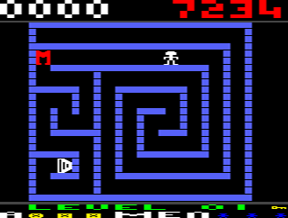

# JiggleSoft's Atari 2600 Game

## Escape-MCP

This game is work in progress with no specified completion date.
I have a lot of other commitments and do not want to give a concrete release date.

I am looking at a small batch release with a custom cartridge PCB, along with box, and manual etc.

The cartridge and programmer will be released open source for others to benefit from.

I am anticipating that the source code, artwork, documentation, binary rom image, etc. to this game will be released as open source approximately one year after the cartridges have been sold. 

## Preview

---

## Licensing

Copyright (C) 2020 Justin Lane.

## Contact Us

Please email atari2600@jigglesoft.co.uk regarding this repository.

